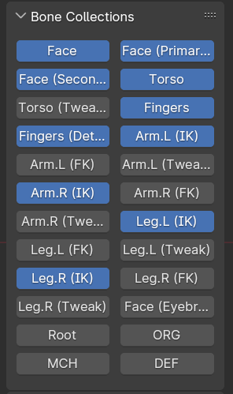

# Bone Collection Toggle Addon for Blender

This addon adds a panel into the 3D View's sidebar for toggling visibility of bone groups. Provides the same sort of functionality as the UI generated in Rigify rigs, but works on any armature.

# Installing

[Download this repository as a ZIP file](https://github.com/stuf/bone_collection_toggle/archive/refs/heads/main.zip), and install it like any other addon in Blender through the Blender add-ons window.
